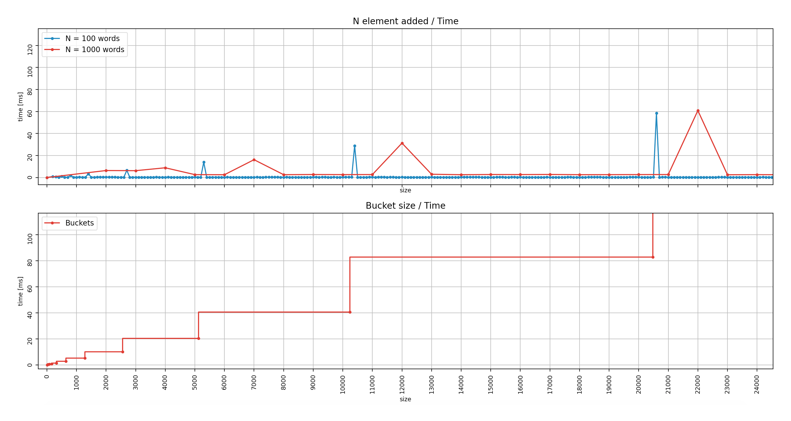

# Mini-project report 

Members: Paolo Molinaro, Rutger Arend Nieuwenhuis 

Program: Network Security 

Course: 1DV501   

Date of submission: 2020-10-23


## Introduction

The project is aimed to work with and analyse large texts, implementing two different data structures:
 - A binary search tree based table
 - A hash based set
 
We use these data structures to solve and analyse different types of word related tasks.

## Part 1: Divide text into words

The word list will have the following characteristics:
- Words with an apostrophe will be written contracted.
- Case insensitive, so "Hello" and "hello" will count as the same word.
- Words like "test-case" will be counted as two words, "test" and "case".

In order to generate a list of words compliant to these rules, we will replace all characters with white spaces, except for alphabetic characters and apostrophes. Then we will contract the words, removing the apostrophes. Finally, we convert it to lower case and split into a list of words with the following line of Python code.

```py
words = re.sub("[^a-zA-Z']", " ", line).replace("'", "").lower().split()
```

With this set of rules, the word count for the two files will be:
- **11353** for `holy_grail.txt` (Grail file)
- **1989396** for `eng_news_100K-sentences.txt` (news_100k file)

## Part 2: Implementing data structures

We implemented word sets based on a hashing table and a binary search tree (BST), without the use of classes, focussing both on tasks and time efficiency.

- ### For the hash based word set the fundamental functions are implemented as following:

 	* The ``add`` function computes the hash value of the word and adds it to the set if not already added; also, if the number of words is equal to the number of buckets available, it will call the rehash function.
		```py
		def add(word_set, word):

			global size

			h = hash_element(word_set, word)

			if word not in word_set[h]:
				word_set[h].append(word)
				size += 1

			if size == len(word_set):
				rehash(word_set)
		```
		The ``hash_element`` computes the hash value using the DJB2 algorithm for a given word (element), this algorithm has been chosen for fewer collision and better avalanching.

		The word is passed into the hash_element and the function will return an unsigned integer, the hash_value variable is initialized and set to 5381 (this is just the value used by the djb2 algorithm for fewer collision).
    	The actual hash function for each word is build looping through every character, and for every character taking the value of the hash variable, shifting it left 5 binary bits and adding the hash_value to that (instead of multiplying by 33, this way is more efficient). Next up, it adds the ascii value of every single character of the word.
		The final hash value is computed doing the modulus by the actual size of max buckets of the AND operation between the hash variable and "-1" (two-complement binary 32bits is 0xFFFFFFFF in hexadecimal).

		Check the [source](https://theartincode.stanis.me/008-djb2/) for in-depth information.
		```py
		def hash_element(word_set,word):

			hash_value = 5381
			for x in word:
				hash_value = (( hash_value << 5) + hash_value) + ord(x)
			return ( hash_value & 0xFFFFFFFF) % len(word_set)
		```
		The ``rehash`` function rehashes the hash table. First it appends every word to a temporary list called "rehash_temp", then it empties the word set and doubles it in size, only to call the add function afterwards to add again every word stored in the 'rehash_temp' list.
		```py
		def rehash(word_set):

			global size

			rehash_temp = []

			for word in word_set:
				for element in word:
					rehash_temp.append(element)

			for i in range(len(word_set)):
				word_set[i] =[]
				word_set.append([])

			size = 0
			for element in rehash_temp:
				add(word_set,element)
		```

	* The result obtained with the DJB2 algorithm is different from the given result in ``word_set_main.py``. Its high efficiency is revealed when used with large files and consequently with larger bucket sizes, maintaining a relatively low and consistent number of elements in the same bucket independently from the quantity of unique words in the word set.
	 
 	* The largest bucket size obtained is **5** in the `holy_grail.txt` (Grail) file and **7** in the `eng_news_100K-sentences.txt` (news_100k) file.

- ### For the BST based table the fundamental functions are implemented as follows:
 	
	* The ``add`` function adds a new key-value pair to a table. If the key already exists, the value is updated. When adding a new key-value pair, one of four cases will occur:
		1) The root has no value yet, so we initialize a root.
		2) The key is equal to the key value in the current node, so we update it.
		3) The key comes before the current node in alphabetical order.
		4) The key comes after the current node in alphabetical order.
	
		To make the BST table versatile and efficient, no matter the type of input given, we decided to compare a lowercase version of the key to avoid complications due to the ASCII code order and the alphabetical order, as shown in the code below:

		```py
		def add(root, key, value):

			key_compare = key.lower() if isinstance(key, str) else key
			root_key_compare = root[0].lower() if isinstance(root[0], str) else root[0]

			# Case 1
			if root[0] is None:
				root[0] = key
				root[1] = value

			# Case 2
			elif root_key_compare == key_compare:
				root[1] = value

			# Case 3 (move left)
			elif key_compare < root_key_compare:  
				if root[2]:  
					add(root[2], key, value)  
				else:  
					root[2] = [key, value, None, None]

			# Case 4 (move right)
			elif key_compare > root_key_compare:
				if root[3]:
					add(root[3], key, value)
				else:
					root[3] = [key, value, None, None]
		```
	* The ``max_depth`` function returns the maximum depth of the tree, as an integer corresponding to the length of longest root to leaf path. The method showed below, edited to fit our application may be found in [this article](https://www.geeksforgeeks.org/write-a-c-program-to-find-the-maximum-depth-or-height-of-a-tree/).
		```py
		def max_depth(node):

			if not node[0]:  # Root does not exist
				return 0

			left_depth = 0
			right_depth = 0

			# Computes the depth of the branch to the left
			if node[2]:
				left_depth = max_depth(node[2])

			# Computes the depth of the branch to the right
			if node[3]:
				right_depth = max_depth(node[3])

			# Returns the highest depth and adds one for the current node
			return max(left_depth, right_depth) + 1
		```

	* With the function described above the max depth is **26** for the `holy_grail.txt` (Grail file) and **39** for the `eng_news_100K-sentences.txt` (news_100k file).

## Part 3: Word related exercises

### 1) Hash set - Unique word count
The task objective is to count the amount of unique words in the hash set.

Given that a set, by definition only contains unique words, (as also defined in the ``add`` function) so the count can be accomplished by adding together the length of every list of each bucket in the word set.

Obtaining a unique words count of **1876** for the `holy_grail.txt` (Grail file) and **77601** for the `eng_news_100K-sentences.txt` (news_100k file).


### 2) BST table - Words lengths count
The task objective is to count the amount of words of a given length the length in both files (``Grail`` and ``news_100k``).

This can be accomplished counting the length of the words in each file and adding them to the BST, with the word length as the key and the count as the value, obtaining in this way the necessary data to draw the bar chart shown below. 

As pictured, in the Grail file the most common length is 4, followed by 3 and 2; while in the news_100k file the most common length is 3, followed by 4 and 2. The distribution of results is coherent with the ["English Letter Frequency Counts:
Mayzner Revisited"](http://norvig.com/mayzner.html) publication.


**Logarithmic scale for better interpretation of the occurrences**


### 3) BST Table - Top 10 most frequent words
The task objective is to present a list of the 10 most frequent words, considering only words with more than 4 characters, for both files (``Grail`` and ``news_100k``).

This can be accomplished first creating a BST with all the words in each file with a length larger than 4 (in our case we decided to make the BST versatile adding a parameter ``minimum_word_length`` to set the minimum length desired) as the keys and the amount that they occur as the value, words will be case insensitive, than creating a list of tuples with the 10 most frequently used words and their amount of occurrences with the ``top_10_most_frequent_words`` function, afterwards writing the list file with the supplied words and their amount of occurrences provided by previous function. In the following table is possible to view the results for both files.


|–|news_100k|––––––!––––––––|Grail|–––––––––|
|:-:|:-:|:-:|:-:|:-:|

|word|occurrences|-|word|occurrences|
|:--------------:|:--------------:|:-:|:--------------:|:--------------:|
|their|6146|-|arthur| 261|
|about|4615|-|launcelot|102|
|there|4301|-|knight|84|
|would|3896|-|galahad|81|
|people|3891|-|father|76|
|which|3585|-|knights|69|
|after|3047|-|bedevere|68|
|first|3044|-|guard|58|
|years|2926|-|robin|58|
|other|2760|-|right|57|


## Part 4: Measuring time

### 1) BST table -  Measure the time to look-up a fix number of keys in trees of different sizes, measuring also the max tree depth at the same sizes.
To analyse the time it takes to look up elements in the BST, we generated a list of the unique words in ```news_100k``` using the Bash command line:

```sort eng_news_100K-sentences_words.lst | uniq | sort -R > eng_news_100K-sentences_words_unique.lst```

Next up, we get 20000 unique words at random to look up:

```shuf -n 20000 eng_news_100K-sentences_words_unique.lst > look_up_words.lst```

We add 1000 words to the BST, and after each addition, measure the time it takes to look up the 20000 words generated above.
 
The *time analysys list of tuple* computed by the following function has this structure: *[(table_size1, time1), (table_size2, time2), ..., (table_sizeN, timeN)]*.

```py
def measure_time(words, look_up_words):

    root = tbl.new_empty_root()

    # Look up time vs table size
    time_size = []
    words_added = 0

    for word in words:

        tbl.add(root, word.strip(), 0)  # Value is not relevant
        words_added += 1

        # If a multiple of 1000 words have been added, add data to the list
        if words_added % 1000 == 0:
            start = time.time()

            for look_up_word in look_up_words:
               tbl.get(root, look_up_word)

            end = time.time()
            total_time = round(end - start, 3)  # Measure the time elapsed since start time

            time_size.append((words_added, total_time))

    return time_size
```

Another list of tuples with depth analysis for a BST of ``news_100k`` is created to study the trend of the depth of the BST. 

The *depth analysys list of tuple* computed by the following function has this structure: *[(table_size1, depth1), (table_size2, depth2), ..., (table_sizeN, depthN)]*.

```py
def measure_depth(words):

    root = tbl.new_empty_root()

    # Max depth vs size
    depth_size = []
    words_added = 0

    for word in words:

        tbl.add(root, word.strip(), 0)  # Value is not relevant
        words_added += 1

        # If a multiple of 1000 words have been added, add data to the list
        if words_added % 1000 == 0:
            depth_size.append((words_added, tbl.max_depth(root)))

    return depth_size
```

We want to measure the time required multiple times and compute an average, to try to negate the influence that the OS background processes have on the execution time. Therefore we decided to execute the analysis **50** times and average the results to generate a more faithful trend, as show in the extract of code below:

```py
amount_of_measurements = 50
execution_time = []

for _ in range(amount_of_measurements):

    data = measure_time(words, look_up_words)

    unzipped_data = list(zip(*data))

    if execution_time:  # If the list has been initialized, we add the numbers
        for i, exec_time in enumerate(unzipped_data[1]):  # Loop through the execution times
            execution_time[i] += exec_time

    else:  # If the list has not been initialized yet, we initialize it
        for exec_time in unzipped_data[1]:  # Loop through the execution times
            execution_time.append(exec_time)

execution_time = [t / amount_of_measurements for t in execution_time]  # Compute the averages
```

As we can see the representation ``time`` over ``table size`` resembles a logarithmic trend, as expected, with minor discrepancies; while the representation ``depth`` over ``table size`` gives us a positive feedback of the efficiency of our BST implementation, manitaining a fairly low depth even at larger table sizes.


We can safely say that the time complexity of looking up words in a BST is O(log2(N)) with N the size of the BST.

### 2) Hash set - Measure the time it takes to add new elements to your hash set and how it correlates to rehashing, measure also the max bucket size at various set sizes.
This task was accomplished by adding words belonging to the ``news_100k`` file to the hash set, taking a 3 timestamps respectively every 100 and 1000 new word added and when each rehashing was happening while the max bucket size was also stored, as shown below:
```py
for word in words_list: 
    ws.add(word_set,word)

    # Storing size and timestamp every new unique 100 words added
    if ws.size == aux_hundred:
        aux_hundred += 100
        x_size1.append(aux_hundred)
        time_t1.append( (time.time() - timestamp_100k ) * 1000 )    # Multiplied by 1000 to rapresent time in millisecond
        timestamp_100k = time.time()

    # Storing size and timestamp every new unique 1000 words added
    if ws.size == aux_thousand:
        aux_thousand += 1000
        x_size2.append(aux_thousand)
        time_t2.append( (time.time() - timestamp2_100k ) * 1000  )
        timestamp2_100k = time.time()

    # Storing max bucket size and timestamp right before rehashing
    if ws.size == aux_maxbuckets:
        x_max_bucket.append(ws.max_bucket_size(word_set))
        aux_maxbuckets *= 2
        x_buckets.append(aux_maxbuckets)
        time_t3.append( (time.time() - start_time_100k) * 1000  )
    
x_max_bucket.append(ws.max_bucket_size(word_set)) 	# Adding the last max bucket size
```
This permitted us to represent `number of element added` over `time` and `bucket size` over `time`. The combined representation of these two graphs facilitates the understanding of how rehashing delays the insertion of new words, visualized as peaks. In the zoomed-in picture it is possible to see the maximum bucket size after each rehashing more clearly.


**zoom-in**


As we can see also from the table below, the Max Bucket Size (**MBS**) is fairly low relatively to the Hash Set Total Buckets size (**HSTS**) because the DJB2 algorithm is highly efficent.

|     HSTS      |      MBS      |_|     HSTS      |      MBS      | 
|:--------------:|:--------------:|:-:|:--------------:|:--------------:|
| 		10  	| 		2		|-|		1280	|		4		|
|		20		|		2		|-|		2560	|		5		|
|		40		|		2		|-|		5120	|		6		|
|		80		|		3		|-|		10240	|		5		|
|		160		|		3		|-|		20480	|		5		|
|		320		|		3		|-|		40960	|		6		|
|		640		|		5		|-|		81920	|		7		|


We need to stress that we are talking about *milliseconds* measurements. Therefore, the following analysis considers a trend that in absolute terms is similar to linear O(1) as we can see already when adding 100 words at the time. But if we consider the divergence trend for bigger sizes added at the same time, we can assert that probably the hashing set will not be linear for extremely large set of words and the time to rehash will cumulate proportionally. This is because the program needs time to check if a word already exists in the set. If it already exists, the word won't be added and the set size won't increase, but the computation was still made.

Interestingly, if we consider to enter **only unique words**, eliminating in this way the time to look up if a word already existing we can see that the algorithm behaves linearly, beside the rehashing delay (peaks). Also, every rehash takes less time than with the non-unique list. The results with only unique words is shown below:


**zoom-in**


## Project conclusions and lessons learned

### Technical issues 
- We did not encounter any difficulties in carrying out the tasks.
- Handling BST table and Hash set in Python without classes is not the best coding practice. Furthermore, for very large texts, Python can be quite slow. Especially a single-threaded, non-class based implementation. Programming a similar structure in C, or even better, in C++ using a class, is likely prefered for very large texts. Nevertheless, the results obtained with Python are quite satisfactory.

### Project issues
- We did not encounter any problems with communication or division of tasks.
- We met the same day that the project tasks were published and we completed the first part right away toghether defining the "word characteristics" so we could start as soon as possible to work on implementations.
Then we decided to divide the work in two parts, Paolo would have handled the hash set and Rutger the BST table, we kept in touch during the whole implementation process, updaiting each other on the tasks completed. We didn't need to spend time justifying the written code as we have always commented extensively on the various steps taken. We have periodically reviewed each other's code, suggesting each other improvements.
Paolo handled the report, with periodical review and correction by Rutger.